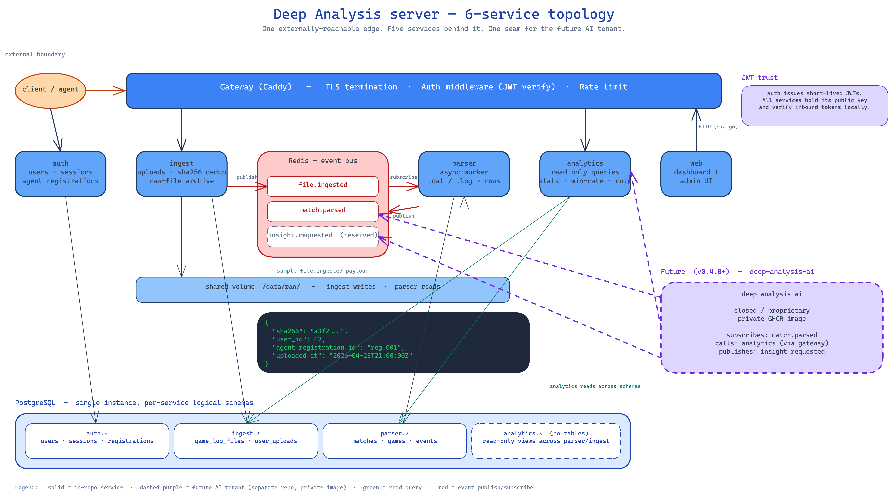

# Deep Analysis

Open-source AGPL-3.0 server for the Deep Analysis platform — a self-hosted MTGO match analytics system.

## What this is

Deep Analysis is a self-hosted platform for tracking and analyzing Magic: The Gathering Online match data. This repository contains the server-side stack: six independent services running as a single Docker Compose application.

The matching Windows agent (MIT license) lives at [sentania-labs/deep-analysis-agent](https://github.com/sentania-labs/deep-analysis-agent) *(coming soon)*.

## Documentation

- [docs/deploy.md](docs/deploy.md) — Deployment + environment
- [docs/admin-bootstrap.md](docs/admin-bootstrap.md) — Initial admin password flow
- [docs/backup.md](docs/backup.md) — Backup strategy
- [docs/events.md](docs/events.md) — Redis event topics (AI contract)
- [docs/migrations.md](docs/migrations.md) — Alembic usage
- [docs/diagrams/](docs/diagrams/) — Architecture + flow diagrams (diagram content arrives in W1c-iii)

## Architecture



Source: [`docs/diagrams/architecture.excalidraw`](docs/diagrams/architecture.excalidraw). See [`docs/diagrams/README.md`](docs/diagrams/README.md) for regeneration instructions.

## Quickstart

The current slice (W1a) stands up the infra containers only — PostgreSQL,
Redis, and the Caddy gateway. Application services land in subsequent
slices; the gateway will 502 on `/api/*` routes until then.

```bash
# 1. Clone and enter the repo
git clone https://github.com/sentania-labs/deep-analysis-server.git
cd deep-analysis-server

# 2. Configure secrets
cp .env.example .env
# Edit .env and set POSTGRES_PASSWORD to a real value

# 3. Start the stack
docker compose up -d

# 4. Sanity-check
docker compose ps                  # postgres + redis should report healthy
curl http://localhost/health       # gateway → "ok"

# 5. Tear down (volumes preserved)
docker compose down
```

Requirements: Docker Engine 24+ with the Compose v2 plugin.

## Services

| Service    | Role                                               |
|------------|----------------------------------------------------|
| `gateway`  | TLS termination, request routing, rate limiting    |
| `auth`     | User accounts, sessions, agent registrations       |
| `ingest`   | File upload, deduplication, event publishing       |
| `parser`   | Async parse worker: `.dat`/`.log` → match records  |
| `analytics`| Read-only stats and win-rate query API             |
| `web`      | Dashboard UI                                       |

Shared infrastructure: PostgreSQL (single instance, per-service schemas), Redis (event bus + cache), Caddy (TLS).

## Self-hosting

> **Note:** Service code is under development. This scaffolding is the foundation for v0.4.0.

```bash
# Coming in Phase 2 — service implementations
docker compose up -d
```

Full deployment documentation will live in `docs/` once services are implemented.

## Observability

Each service emits structured JSON logs and exposes a `/metrics` endpoint (Prometheus text format).

Optional Loki + Grafana + Prometheus stack:

```bash
docker compose --profile observability up -d
```

## License

GNU Affero General Public License v3.0 — see [LICENSE](LICENSE).

The Deep Analysis AI add-on (advanced analytics and coaching) is a separate proprietary component distributed via Docker image. Source for this repository is AGPL-3.0.
